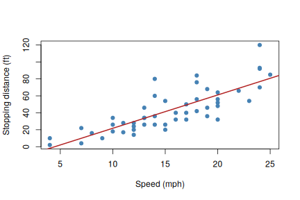

This post is written in **R Markdown** (`.Rmarkdown`). When you save or knit it in RStudio,
blogdown runs the R code and writes the result to `index.markdown`, which Hugo then turns into this page.

## Summarise a data set


```r
summary(cars)
##      speed           dist       
##  Min.   : 4.0   Min.   :  2.00  
##  1st Qu.:12.0   1st Qu.: 26.00  
##  Median :15.0   Median : 36.00  
##  Mean   :15.4   Mean   : 42.98  
##  3rd Qu.:19.0   3rd Qu.: 56.00  
##  Max.   :25.0   Max.   :120.00
fit <- lm(dist ~ speed, data = cars)
coef(fit)
## (Intercept)       speed 
##  -17.579095    3.932409
```

## Include a plot


```r
plot(cars, pch = 19, col = "steelblue",
     xlab = "Speed (mph)", ylab = "Stopping distance (ft)")
abline(fit, col = "firebrick", lwd = 2)
```

<div class="figure" style="text-align: center">

<p class="caption">Stopping distance vs. speed</p>
</div>

## Math

Inline math like $y = \beta_0 + \beta_1 x + \varepsilon$ works, and so do display equations:

$$
\hat{\beta}_1 = \frac{\sum_i (x_i - \bar{x})(y_i - \bar{y})}{\sum_i (x_i - \bar{x})^2}
$$
