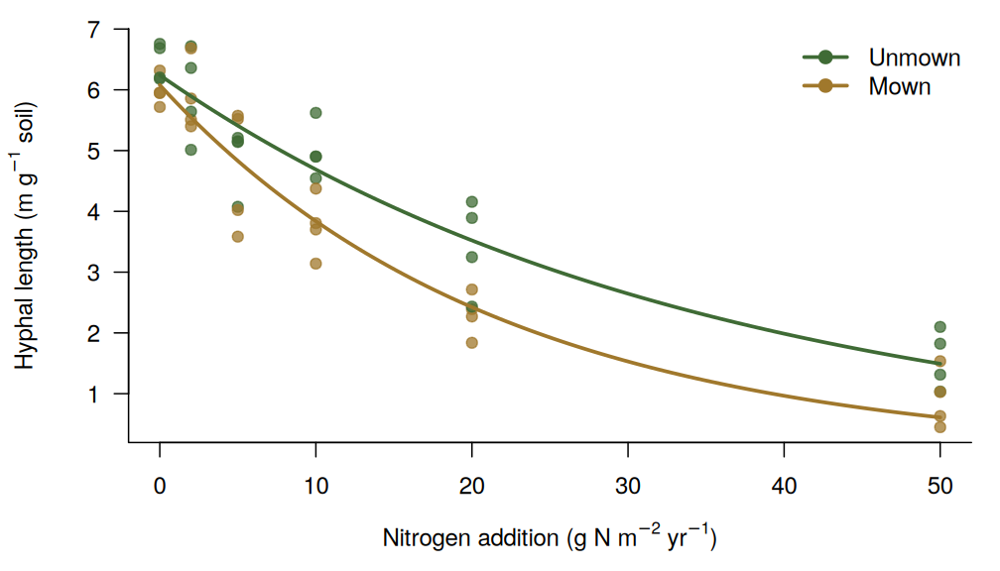

> **This is an example page.** Edit `content/en/project/example-amf-nitrogen/index.Rmarkdown`
> in RStudio and save — blogdown will re-knit it. The figure below is drawn from *simulated* data.

## Background

Nitrogen deposition is reshaping grassland plant communities, but the response of the
belowground symbiotic network — arbuscular mycorrhizal (AM) fungi — and its consequences for
soil carbon remain poorly resolved. AM fungal mycelia are an important input of carbon to soil
and a pathway for plant nutrient uptake.

## Objectives

1. Quantify how AM fungal hyphal length and mycelial carbon pools respond to a gradient of nitrogen addition, with and without mowing.
2. Link changes in AM fungal community composition to plant community shifts.
3. Estimate the contribution of AM fungal necromass to mineral-associated organic carbon.

## Approach

Long-term nitrogen × mowing field experiment in a meadow steppe, combined with in-growth mesh
bags, ¹³C labelling and amplicon sequencing.

## Example figure

Figure: simulated AM fungal hyphal length along a nitrogen addition gradient (example data).

## Team

- Haiyang Zhang (PI)
- Students and collaborators — *add names here*

## Outputs

- Zhang X, Yang J, …, **Zhang H**\*, Han X (2026) Mowing enhances the sensitivity of arbuscular mycorrhizal mycelial carbon pools to nitrogen enrichment in grassland ecosystem. *Journal of Ecology*. [doi:10.1111/1365-2745.70429](https://doi.org/10.1111/1365-2745.70429)
