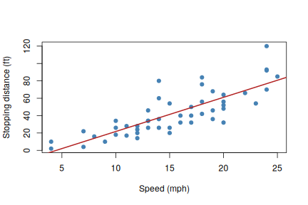

这篇文章用 **R Markdown**（`.Rmarkdown`）写成。在 RStudio 里保存或 Knit 时，
blogdown 会运行其中的 R 代码，把结果写入 `index.markdown`，再由 Hugo 生成网页。

## 数据摘要


```r
summary(cars)
##      speed           dist       
##  Min.   : 4.0   Min.   :  2.00  
##  1st Qu.:12.0   1st Qu.: 26.00  
##  Median :15.0   Median : 36.00  
##  Mean   :15.4   Mean   : 42.98  
##  3rd Qu.:19.0   3rd Qu.: 56.00  
##  Max.   :25.0   Max.   :120.00
fit <- lm(dist ~ speed, data = cars)
coef(fit)
## (Intercept)       speed 
##  -17.579095    3.932409
```

## 插入图表


```r
plot(cars, pch = 19, col = "steelblue",
     xlab = "Speed (mph)", ylab = "Stopping distance (ft)")
abline(fit, col = "firebrick", lwd = 2)
```

<div class="figure" style="text-align: center">

<p class="caption"><U+5239><U+8F66><U+8DDD><U+79BB><U+4E0E><U+8F66><U+901F><U+7684><U+5173><U+7CFB></p>
</div>

## 数学公式

行内公式如 $y = \beta_0 + \beta_1 x + \varepsilon$，也支持独立公式：

$$
\hat{\beta}_1 = \frac{\sum_i (x_i - \bar{x})(y_i - \bar{y})}{\sum_i (x_i - \bar{x})^2}
$$
