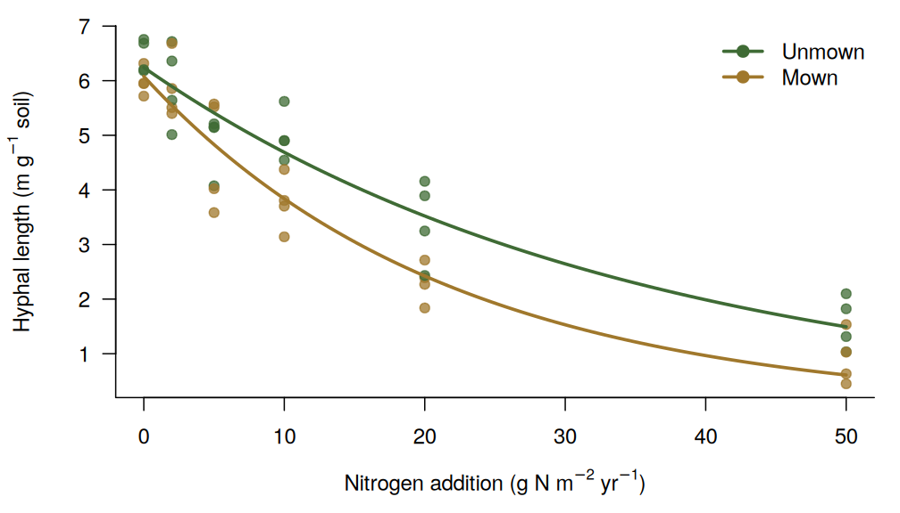

> **这是一个示例页面。** 在 RStudio 中编辑 `content/zh/project/example-amf-nitrogen/index.Rmarkdown`
> 并保存，blogdown 会自动重新 knit。下图使用的是**模拟数据**。

## 研究背景

氮沉降正在改变草地植物群落，但地下共生网络——丛枝菌根（AM）真菌——的响应及其对土壤碳的影响仍不清楚。
AM 真菌菌丝是土壤碳输入的重要来源，也是植物获取养分的重要途径。

## 研究目标

1. 量化 AM 真菌菌丝长度和菌丝碳库对氮添加梯度及刈割的响应；
2. 将 AM 真菌群落组成变化与植物群落变化联系起来；
3. 估算 AM 真菌残体对矿物结合态有机碳的贡献。

## 研究方法

依托草甸草原长期氮添加 × 刈割野外实验，结合内生长网袋、¹³C 标记和扩增子测序。

## 示例图

图：氮添加梯度下 AM 真菌菌丝长度（模拟数据示例）。

## 项目成员

- 张海洋（负责人）
- 学生与合作者——*在此添加*

## 代表性成果

- Zhang X, Yang J, …, **Zhang H**\*, Han X (2026) Mowing enhances the sensitivity of arbuscular mycorrhizal mycelial carbon pools to nitrogen enrichment in grassland ecosystem. *Journal of Ecology*. [doi:10.1111/1365-2745.70429](https://doi.org/10.1111/1365-2745.70429)
